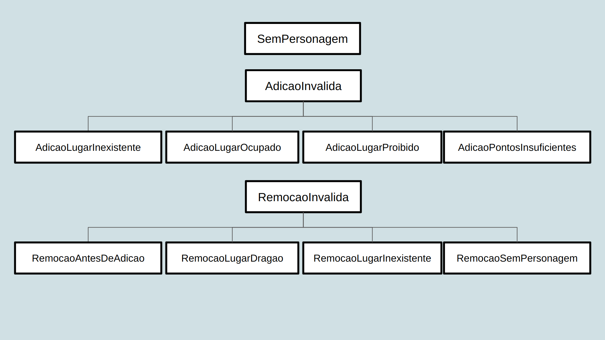

# Projeto `Mate o Dragão`

# Descrição Resumida do Projeto/Jogo

O jogo se chama Mate o Dragão, pois essa é a única maneira de o jogador vencer. Para isso, o jogador escolhe soldados para colocar nas posições que preferir no campo de batalha, e enquanto os personagens se movem de forma autônoma, 
o jogador controla a princesa para não deixá-la ser atingida pelos projéteis. O jogador perde se a princesa ou todos os soldados morrerem.

# Equipe
* Áureo Henrique e Silva Marques - 213374
* Lindon Jonathan Sanley dos Santos Pereira Monroe - 220407

# Vídeos do Projeto

## Vídeo da Prévia
[Link para o vídeo](https://drive.google.com/file/d/1WTYxDMbC_eBaEOWbAoLYA-gZTC5DdQ9w/view?usp=sharing)

## Vídeo do Jogo
> <Coloque um link para o vídeo em que é demonstrada a versão final do jogo. Esse vídeo deve ter em torno de 5 minutos. Este vídeo não apresenta slides, nem substitui a apresentação final do projeto, que será feita por conferência. Ele mostra apenas o jogo em funcionamento.>

# Slides do Projeto

## Slides da Prévia
[Link para os slides](https://docs.google.com/presentation/d/1AsV5UUcxe-LLS95gD0u0uFggMae4aAfRPWseXTlmxlo/edit?usp=sharing)

## Slides da Apresentação Final
`<Coloque um link para os slides da apresentação final do projeto.>`

## Relatório de Evolução

> <Relatório de evolução, descrevendo as evoluções do design do projeto, dificuldades enfrentadas, mudanças de rumo, melhorias e lições aprendidas. Referências aos diagramas e recortes de mudanças são bem-vindos.>

# Destaques de Código

> <Escolha trechos relevantes e/ou de destaque do seu código. Apresente um recorte (você pode usar reticências para remover partes menos importantes). Veja como foi usado o highlight de Java para o código.>

~~~java
// Recorte do seu código
public void algoInteressante(…) {
   …
   trechoInteressante = 100;
}
~~~

# Destaques de Pattern
`<Destaque de patterns adotados pela equipe. Sugestão de estrutura:>`

## Diagrama do Pattern
`<Diagrama do pattern dentro do contexto da aplicação.>`

## Código do Pattern
~~~java
// Recorte do código do pattern seguindo as mesmas diretrizes de outros destaques
public void algoInteressante(…) {
   …
   trechoInteressante = 100;
}
~~~

> <Explicação de como o pattern foi adotado e quais suas vantagens, referenciando o diagrama.>

# Conclusões e Trabalhos Futuros

> <Apresente aqui as conclusões do projeto e propostas de trabalho futuro. Esta é a oportunidade em que você pode indicar melhorias no projeto a partir de lições aprendidas e conhecimentos adquiridos durante a realização do projeto, mas que não puderam ser implementadas por questões de tempo. Por exemplo, há design patterns aprendidos no final do curso que provavelmente não puderam ser implementados no jogo -- este é o espaço onde você pode apresentar como aplicaria o pattern no futuro para melhorar o jogo.>

# Documentação dos Componentes

O vídeo a seguir apresenta um detalhamento de um projeto baseado em componentes:

# Diagramas

## Diagrama Geral do Projeto

> <Apresente um diagrama geral de organização da organização do seu sistema. O formato é livre. A escolha de um ou mais estilos arquiteturais será considerado um diferencial.>

> <Faça uma breve descrição do diagrama.>

## Diagrama Geral de Componentes

### Exemplo 1

Este é o diagrama compondo componentes para análise:

### Exemplo 2

Este é um diagrama inicial do projeto de jogos:

### Exemplo 3

Este é outro diagrama de um projeto de vendas:

Para cada componente será apresentado um documento conforme o modelo a seguir:

## Componente `<Nome do Componente>`

> <Resumo do papel do componente e serviços que ele oferece.>

**Ficha Técnica**
item | detalhamento
----- | -----
Classe | `<caminho completo da classe com pacotes>`   Exemplo: `pt.c08componentes.s20catalog.s10ds.DataSetComponent`
Autores | `<nome dos membros que criaram o componente>`
Interfaces | `<listagem das interfaces do componente>`

### Interfaces

Interfaces associadas a esse componente:

Interface agregadora do componente em Java:

~~~java
public interface IDataSet extends ITableProducer, IDataSetProperties {
}
~~~

## Detalhamento das Interfaces

### Interface `<nome da interface>`

`<Resumo do papel da interface.>`

~~~
<Interface em Java.>
~~~

Método | Objetivo
-------| --------
`<id do método em Java>` | `<objetivo do método e descrição dos parâmetros>`

## Exemplo:

### Interface `ITableProducer`

Interface provida por qualquer fonte de dados que os forneça na forma de uma tabela.

~~~java
public interface ITableProducer {
  String[] requestAttributes();
  String[][] requestInstances();
}
~~~

Método | Objetivo
-------| --------
`requestAttributes` | Retorna um vetor com o nome de todos os atributos (colunas) da tabela.
`requestInstances` | Retorna uma matriz em que cada linha representa uma instância e cada coluna o valor do respectivo atributo (a ordem dos atributos é a mesma daquela fornecida por `requestAttributes`.

### Interface `IDataSetProperties`

Define o recurso (usualmente o caminho para um arquivo em disco) que é a fonte de dados.

~~~java
public interface IDataSetProperties {
  public String getDataSource();
  public void setDataSource(String dataSource);
}
~~~

Método | Objetivo
-------| --------
`getDataSource` | Retorna o caminho da fonte de dados.
`setDataSource` | Define o caminho da fonte de dados, informado através do parâmetro `dataSource`.

# Plano de Exceções

## Diagrama da hierarquia de exceções
`<Elabore um diagrama com a hierarquia de exceções como detalhado abaixo>`

## Descrição das classes de exceção

Classe | Descrição
----- | -----
SemPersonagem | Indica que não pode iniciar o jogo sem personagens no campo.
AdicaoInvalida | Engloba todas as exceções de adições não aceitas.
AdicaoLugarInexistente | Indica que o jogador tentou adicionar em uma posição que nem existe no campo.
AdicaoLugarOcupado | Indica que já há um personagem na posição solicitada. 
AdicaoLugarProibido | Indica que não pode inserir um personagem naquela posição.
AdicaoPontosInsuficientes | Indica que não possui pontos suficientes para o atual personagem.
RemocaoInvalida | Engloba todas as exceções de remoções não aceitas.
RemocaoAntesDeAdicao | Indica a tentativa de remoção antes de inserir pelo menos um personagem.
RemocaoLugarDragao | Indica que não pode remover o dragão.
RemoçãoLugarInexistente | Indica que o jogador tentou remover de uma posição que nem existe no campo.
RemocaoSemPersonagem | Indica que não há personagem no local de remoção.
