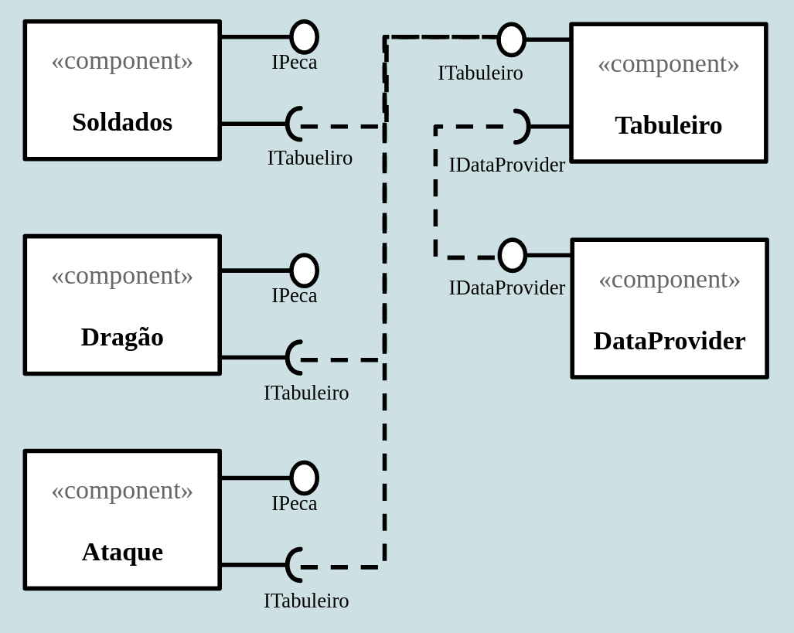

# Jogo-Mate-o-Dragão

# Projeto do Jogo: Mate o Dragão

# Equipe
* Áureo Henrique e Silva Marques - 213374
* Lindon Jonathan Sanley dos Santos Pereira Monroe - 220407

# Descrição Resumida do Projeto
Este é o projeto do jogo Mate o Dragão, um jogo autônomo em que o jogador escolhe soldados para colocar no campo de batalha, com o único objetivo de matar o dragão.

# Vídeo do Projeto
[Link para o vídeo](https://drive.google.com/file/d/1WTYxDMbC_eBaEOWbAoLYA-gZTC5DdQ9w/view?usp=sharing)

# Diagrama Geral de Componentes

# Componente `DataProvider`

## Interfaces

Interfaces associadas a esse componente:

Campo | Valor
----- | -----
Classe | `<caminho completo da classe com pacotes>`   Exemplo: `pt.c08componentes.s20catalog.s10ds.DataSetComponent`
Autores | `Áureo e Lindon Jonathan`
Objetivo | `Obter os dados inseridos pelo usuário e fornecê-los à classe Tabuleiro.`
Interface | `IDataProvider`
~~~
public interface IGetData {
  public void inserePersonagem();
  public void removePersonagem();
  public void setX(int x);
  public void setY(int y);
  public void setTipo(String tipo);
  public String [] getData();
}
public interface IPontos {
  public void removePontos(String tipo);
  public void inserePontos(String tipo);
}
public interface IDataProvider extends IGetData, IPontos {
}
~~~

## Detalhamento das Interfaces

### Interface `IGetData`
`Gerencia a inserção e remoção de personagens e suas respectivas posições no vetor que contém esses dados.`

Método | Objetivo
-------| --------
`inserePersonagem` | `Coloca os dados para inserção do personagem no vetor pecaPosition.`
`removePersonagem` | `Retira os dados de inserção do personagem no vetor pecaPosition`
`setX` | `Recebe e define a posição no eixo x do tabuleiro em que se posicionará a peça.`
`setY` | `Recebe e define a posição no eixo y do tabuleiro em que se posicionará a peça.`
`setTipo` | `Recebe e define o tipo do personagem que será inserido no tabuleiro.`
`getData` | `Método para se acessar o vetor privado pecaPosition.`

### Interface `IPontos`
`Aumenta e diminui a pontuação disponível para o jogador.`

Método | Objetivo
-------| --------
`removePontos` | `Diminui os pontos restantes de acordo com o tipo de personagem inserido no vetor pecaPosition.`
`inserePontos` | `Aumenta os pontos restantes de acordo com o tipo de personagem removido do vetor pecaPosition.`

# Componente `Tabuleiro`

## Interfaces

Interfaces associadas a esse componente:

Campo | Valor
----- | -----
Classe | `<caminho completo da classe com pacotes>`   Exemplo: `pt.c08componentes.s20catalog.s10ds.DataSetComponent`
Autores | `Áureo e Lindon Jonathan`
Objetivo | `Inserir e organizar os personagens no jogo e promover as modificações necessárias na sua distribuição no passar dos tempos do jogo.`
Interface | `ITabuleiro`
~~~
public interface ITabuleiro {
  public void modificaTabuleiro();
  public IPeca get Peca(int x, int y);
  public void putPeca(int x, int y, String tipo, Tabuleiro T);
  public void removePeca (int x, int y);
  public void receiveData(IdataProvider dataProvider;)
}
~~~

## Detalhamento das Interfaces

### Interface `ITabuleiro`
`Realiza as modificações que ocorrem na disposição das peças a cada tempo do jogo.`

Método | Objetivo
-------| --------
`modificaTabuleiro` | `Passa duas vezes por todas as posições da matriz de peças e faz elas se movimentarem e disparar ataques.`
`getPeca` | `Retorna uma peça de uma posição da matriz.`
`putPeca` | `Insere uma peça em uma posição da matriz.`
`removePeca` | `Remove uma peça de uma posição da matriz.`
`receiveData` | `Recebe uma instância de IDataProvider que contém os soldados a serem inseridos no tabuleiro e suas respectivas posições.`

# Componente `Soldados`

## Interfaces

Interfaces associadas a esse componente:

Campo | Valor
----- | -----
Classe | `<caminho completo da classe com pacotes>`   Exemplo: `pt.c08componentes.s20catalog.s10ds.DataSetComponent`
Autores | `Áureo e Lindon Jonathan`
Objetivo | `Os soldados são colocados em campo pelo jogador e se movimentam pelo campo e lançam ataques em direção ao dragão.`
Interface | `IPersonagem`
~~~
public interface IPeca {
  public void move();
}
public interface IPersonagem extends IPeca {
  public void perdeVida();
  public void disparaAtaque();
}
~~~

## Detalhamento das Interfaces

### Interface `IPeca`
`Contém o método que indica a movimentação de qualquer peça, sendo comum a todos os soldados, dragão e direções de ataques.`.

Método | Objetivo
-------| --------
`move` | `retorna a posição (x,y) para qual a peça deverá se movimentar`

### Interface `IPersonagem`
`Reúne os métodos de personagem como ações de perda de vida e de disparo de ataque.`.

Método | Objetivo
-------| --------
`perdeVida` | `Ao fazer-se uma varrredura pelo tabuleiro e verificar-se que o personagem está no mesmo espaço que um ataque num mesmo tempo, esse método é acionado para diminuir a vida do personagem.`
`disparaAtaque` | `Ao fazer-se uma varredura pelo tabuleiro e verificar-se que a  frequência do personagem indica que deve lançar um ataque, esse método é acionado. Gera um ataque em direção à posição do dragão, caso seja um dos soldados, e em direção de um soldado num raio de 4 casas ou aleatória, caso seja o dragão.`

# Componente `Dragão`

## Interfaces

Interfaces associadas a esse componente:

Campo | Valor
----- | -----
Classe | `<caminho completo da classe com pacotes>`   Exemplo: `pt.c08componentes.s20catalog.s10ds.DataSetComponent`
Autores | `Áureo e Lindon Jonathan`
Objetivo | `O dragão é o personagem que o jogador deve matar para vencer o jogo. Ele se movimenta pelo campo e lança ataques aleatórios e em direção aos outros personagens.`
Interface | `IPersonagem`
~~~
public interface IPeca {
  public void move();
}
public interface IPersonagem extends IPeca {
  public void perdeVida();
  public void disparaAtaque();
}
~~~

## Detalhamento das Interfaces

### Interface `IPeca`
`Contém o método que indica a movimentação de qualquer peça, sendo comum a todos os soldados, dragão e direções de ataques.`.

Método | Objetivo
-------| --------
`move` | `retorna a posição (x,y) para qual a peça deverá se movimentar`

### Interface `IPersonagem`
`Reúne os métodos de personagem como ações de perda de vida e de disparo de ataque.`.

Método | Objetivo
-------| --------
`perdeVida` | `Ao fazer-se uma varrredura pelo tabuleiro e verificar-se que o personagem está no mesmo espaço que um ataque num mesmo tempo, esse método é acionado para diminuir a vida do personagem.`
`disparaAtaque` | `Ao fazer-se uma varredura pelo tabuleiro e verificar-se que a  frequência do personagem indica que deve lançar um ataque, esse método é acionado. Gera um ataque em direção à posição do dragão, caso seja um dos soldados, e em direção de um soldado num raio de 4 casas ou aleatória, caso seja o dragão.
`

# Componente `Ataque`

## Interfaces

Interfaces associadas a esse componente:

Campo | Valor
----- | -----
Classe | `<caminho completo da classe com pacotes>`   Exemplo: `pt.c08componentes.s20catalog.s10ds.DataSetComponent`
Autores | `Áureo e Lindon Jonathan`
Objetivo | `Os ataques são lançados pelos soldados e pelo dragão e são os responsáveis por diminuir a vida e resistência dos personagens.`
Interface | `IAtaque`
~~~
public interface IPeca {
  public void move();
}

public interface IAtaque extends IPeca {
}
~~~

## Detalhamento das Interfaces

### Interface `IPeca`
`Contém o método que indica a movimentação de qualquer peça, sendo comum a todos os soldados, dragão e direções de ataques.`

Método | Objetivo
-------| --------
`move` | `retorna a posição (x,y) para qual a peça deverá se movimentar`

### Interface `IAtaque`
`Reúne todos os tipos e direções de ataque sob a mesma interface.`

