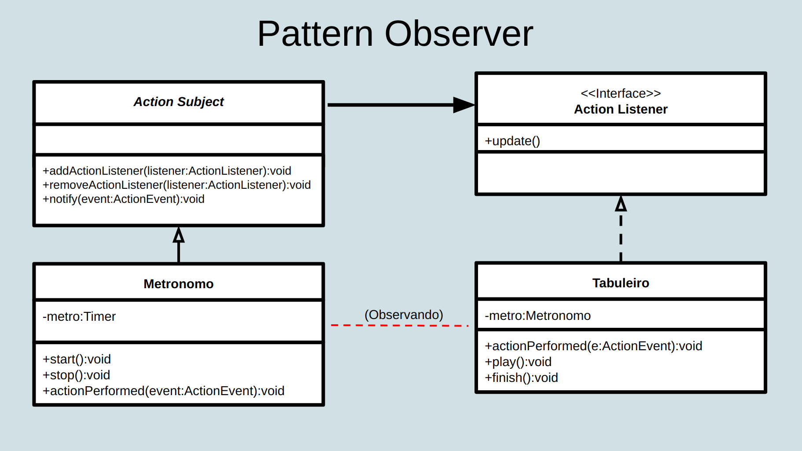
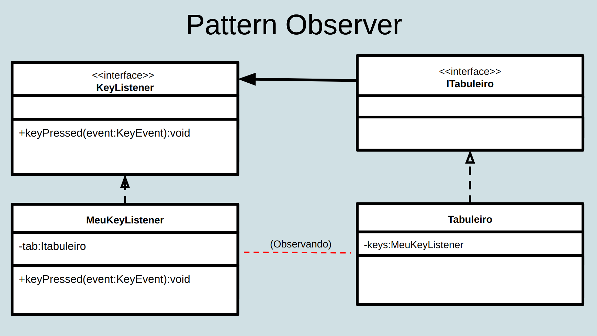
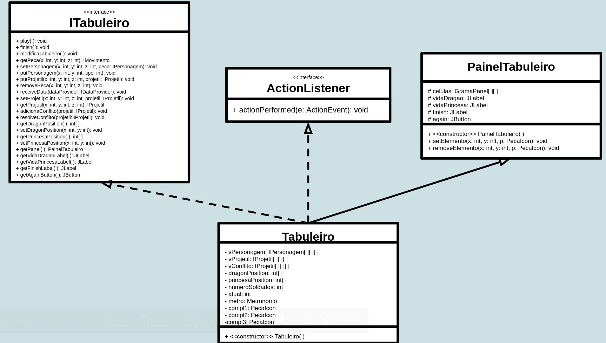
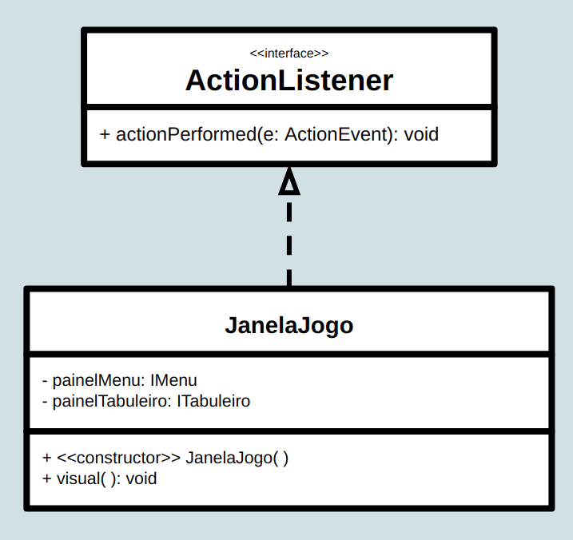

# Projeto `Mate o Dragão`

# Descrição Resumida do Projeto/Jogo

O jogo se chama Mate o Dragão, pois essa é a única maneira de o jogador vencer. Para isso, o jogador escolhe soldados para colocar nas posições que preferir no campo de batalha, e enquanto os personagens se movem de forma autônoma, 
o jogador controla a princesa para não deixá-la ser atingida pelos projéteis. O jogador perde se a princesa ou todos os soldados morrerem.

# Equipe
* Áureo Henrique e Silva Marques - 213374
* Lindon Jonathan Sanley dos Santos Pereira Monroe - 220407

# Vídeos do Projeto

## Vídeo da Prévia
[Link para o vídeo](https://drive.google.com/file/d/1WTYxDMbC_eBaEOWbAoLYA-gZTC5DdQ9w/view?usp=sharing)

## Vídeo do Jogo
> <Coloque um link para o vídeo em que é demonstrada a versão final do jogo. Esse vídeo deve ter em torno de 5 minutos. Este vídeo não apresenta slides, nem substitui a apresentação final do projeto, que será feita por conferência. Ele mostra apenas o jogo em funcionamento.>

# Slides do Projeto

## Slides da Prévia
[Link para os slides](https://docs.google.com/presentation/d/1AsV5UUcxe-LLS95gD0u0uFggMae4aAfRPWseXTlmxlo/edit?usp=sharing)

## Slides da Apresentação Final
`<Coloque um link para os slides da apresentação final do projeto.>`

# Relatório de Evolução

### Introdução / Início do projeto

Nosso projeto nasceu da ideia de fazer um jogo em que arqueiros lutariam para matar um dragão. Para melhorar essa ideia, decidimos adicionar tipos diferentes de soldados, para o jogador decidir com quais personagens ele gostaria de batalhar. Com isso, definimos o contexto base do “Mate o Dragão”.
Na parte inicial do trabalho, tivemos que fazer a apresentação do jogo através dos slides, a qual ficou bem detalhada, e o diagrama de componentes junto com detalhamento das interfaces e dos métodos que seriam usados. Esse diagrama teve alguns defeitos, pois, no começo, ainda estávamos com algumas dúvidas em relação ao conceito de componentes, de interface provida e de interface requerida, mas com a ajuda do PED e com a arguição feita em aula, conseguimos elucidar melhor esses conceitos. 
Nosso diagrama, inicialmente, possuía 5 componentes, como ilustrado abaixo:

Alguns problemas citados na arguição foram a falta de conexão entre Soldados e Ataque e o fato de a interface IPeca não ser requerida por ninguém. Refletimos sobre essas incoerências e concluímos o seguinte: sobre o primeiro problema, definimos que não havia interface entre Soldados e Ataque, pois o Ataque (o qual deve ser imaginado como um projétil, a exemplo de flecha, lança, entre outros) se movimenta no tabuleiro independentemente do personagem que o disparou, sendo a única ação do soldado ser instanciar o objeto Ataque no tabuleiro, e, para isso, não foi necessário o Soldado requerer nenhuma interface do Ataque; 

Segue abaixo, o exemplo do Arqueiro com a Flecha:
~~~java
public class Arqueiro extends Personagem {
	...
	public void disparaProjetil(ITabuleiro tab) {
		...
		tab.putProjetil(x, y, 0, new Flecha(x, y, 0,"ci","flecha-ci.png"));
		...
	}
	...
}	
~~~

Sobre o segundo problema, reparamos que, realmente, a interface IPeca deveria ter sido colocada como requerida pelo Tabuleiro, portanto, corrigimos isso.

### Implementação de Código e Componentização

Após essa etapa inicial, começamos de fato a implementar o código do projeto. Primeiramente, implementamos os componentes Tabuleiro e DataProvider, pois vimos que eles seriam a parte macro do jogo, para depois trabalharmos com os Soldados, Dragão e Ataque, os quais seriam objetos instanciados em cima dos outros dois. 
Frente às sugestões dadas na arguição e por outras ideias que surgiram durante a criação do código, fizemos algumas alterações na nomenclatura e no design do projeto:
- O componente Ataque foi renomeado para Projetil;
- Cada soldado e cada projétil foram considerados como um componente no diagrama;
- Os soldados (Arqueiro, Lanceiro, Mago, Catapulta) e o Dragao são subclasses da classe Personagem, assim como os projéteis Flecha, Lanca, Bola de Energia, Pedra e Bola de Fogo são subclasses da classe Projetil;
- O componente Tabuleiro provê a interface ITabuleiro para cada Personagem e para cada Projetil;
- Cada Personagem provê a interface IPersonagem para Tabuleiro;
- Cada Projetil provê a interface IProjetil para Tabuleiro;
- Cada Projetil provê a interface IProjetil para cada Personagem, pois, para verificação de dano em um personagem, é necessário utilizar o método getDano( ) de IProjetil

Em seguida, começamos a implementar também a interface gráfica. Essa parte foi de certo modo desafiadora, pois tivemos que pesquisar muito sobre os diversos tipos de componentes gráficos que existem, sobre o Java Swing e os métodos para construir os painéis. Mas, ao final, conseguimos criar uma interface agradável. Adicionamos mais dois componentes ao nosso diagrama, que estão relacionados a essa parte gráfica:
- PainelMenu: Esse componente requer as interfaces IDataProvider e ITabuleiro para alterar os dados de acordo com as ações que o usuário realizar;
- JanelaJogo: Esse componente requer as interfaces ITabuleiro e IMenu (provida de PainelMenu) para poder organizar os painéis na janela do jogo.

Em nosso trabalho, como o Tabuleiro precisava ser sempre modificado em um determinado passo de tempo, decidimos utilizar também o Pattern Observer. Para isso, o Tabuleiro está relacionado a um timer (chamado Metronomo), que, a cada “clock”, notifica um ActionEvent para o Tabuleiro, o qual executa o seu ActionPerfomed( ). Esse Pattern foi utilizado também para relacionar o clique de botões do PainelMenu a respectiva ação no jogo que o usuário gostaria de realizar, como adicionar e remover personagens.

Após finalizarmos a implementação do código, decidimos adicionar mais um tipo de personagem ao jogo, o qual é representado pelo componente Princesa e que provê e requer as mesmas interfaces que os outros personagens. A ideia da Princesa é de ser movimentada pelo jogador durante o jogo, por isso, utilizamos também o Pattern Observer para esse componente se movimentar de acordo com os comandos pressionados no teclado.

### Exceções

O tratamento de exceções foi utilizado em nosso trabalho na parte de entrada de dados pelo jogador. Grande parte das exceções foram pensadas no Laboratório 12 e estão relacionadas aos processos de adição e remoção de personagens e início de jogo. Nossas principais preocupações foram: posições fora do tabuleiro e proibidas de adição; entrada incorreta de dados; pontos insuficientes; adição em locais já ocupados; remoção do dragão ou da princesa; remoção em locais não ocupados; remoção sem ter adicionado personagens; e iniciar o jogo sem personagens.

### Problemas enfrentados

O problema principal de nosso projeto foi um erro relacionado às imagens de projéteis no tabuleiro. Para explicar o problema, vamos introduzir a lógica adotada para inserir as imagens de personagem e de projétil no tabuleiro. Foram criadas as classes PecaIcon e PainelTabuleiro, as quais gerenciam as interfaces gráficas das peças em geral e do tabuleiro, respectivamente. As classes Personagem e Projetil estendem PecaIcon para poderem representar graficamente os diversos tipos de peças no jogo e a classe Tabuleiro estende PainelTabuleiro. 

Para inserir uma peça e movimentá-la são utilizados os diversos métodos explicitados nessa documentação, mas os dois principais responsáveis por adicionar e remover o desenho dela são o setElemento() e o removeElemento(). Para a movimentação de projéteis, eventualmente poderia ocorrer um conflito entre eles no meio do campo e para resolver isso criamos um método chamado resolveConflito(), no qual permaneceria o projétil de maior dano.

O erro que surgiu foi que, ao conflitarem, a peça de menor dano realmente era removida, mas sua imagem permanecia, ou seja, em algum momento, projétil e imagem se desvinculavam. Isso ocorreu, pois, ao inserir a peça de maior dano na nova posição, era necessário remover a outra antes. Embora os apontadores no vetor de projéteis eram trocados, a imagem da posição ainda assim precisava ser retirada com o removeElemento(). Com isso, resolvemos essa parte do problema.

No entanto, percebemos que alguns projéteis ainda ficavam parados após serem disparados. Após uma análise mais profunda, concluímos o seguinte: no método modificaTabuleiro(), primeiro os personagens se movimentam e disparam ataques para depois os outros projéteis em campo serem movimentados. No disparo do ataque, o projétil é instanciado na posição de seu personagem e movimentado uma vez. Isso abriu a possibilidade de um outro personagem instanciar seu projétil em cima desse, sem analisar o conflito e gerando o mesmo problema de imagem apresentado anteriormente. Portanto, a solução encontrada foi verificar se havia um projétil na posição antes de disparar.

Um outro problema encontrado tratava-se da quantidade de casas percorridas pelo projétil a cada passo de jogo. Vamos dar o exemplo da pedra da catapulta: a Pedra andava 4 casas a cada passo de jogo, deixando sua permanência em campo muito curta e seu percurso pouco visível. A solução que encontramos foi fazer cada projétil andar de 1 em 1 casa pelo tabuleiro, mas com velocidades diferentes e, para isso, ajustamos o tempo do timer para poucos milissegundos e alteramos a frequência de movimento das peças para deixar algumas mais rápidas e outras mais lentas, deixando a dinâmica do jogo mais fluida.

### Progresso da Interface Gráfica

- Começo do projeto:

- Fim do projeto:

> <Relatório de evolução, descrevendo as evoluções do design do projeto, dificuldades enfrentadas, mudanças de rumo, melhorias e lições aprendidas. Referências aos diagramas e recortes de mudanças são bem-vindos.>

# Destaques de Código

> <Escolha trechos relevantes e/ou de destaque do seu código. Apresente um recorte (você pode usar reticências para remover partes menos importantes). Veja como foi usado o highlight de Java para o código.>
- Destaque para a parte do código que realiza a inserção de um novo personagem no componente DataProvider:
~~~java
public class DataProvider implements IDataProvider{
	...
	/*Recebe o tipo de personagem que deve ser inserido e as coordenadas da posição, 
	 * dependendo da posição pode causar um dos erros.*/
	@Override
	public void inserePersonagem(int comando, int x, int y) throws AdicaoInvalida{
		...
		
		/*Dependendo do tipo de personagem solicitado, ele é colocado no vetor que guarda todos os personagens já inseridos.
		 * E a quantidade de pontos de custo para inserir é reduzida do total disponível.*/
		switch(comando) {
			case 1:
				if (Arqueiro.custo <= pontos) {
					removePontos(Arqueiro.custo);
					setX(x);
					setY(y);
					setTipo(1);
					while (pecaPosition[atual] != -1) {
						atual += 3;
					}
				}
				else
					throw new AdicaoPontosInsuficientes("Pontos Insuficientes!");
				break;
			case 2:
				if (Lanceiro.custo <= pontos) {
					removePontos(Lanceiro.custo);
					setX(x);
					setY(y);
					setTipo(2);
					while (pecaPosition[atual] != -1) {
						atual += 3;
					}
				}
				else
					throw new AdicaoPontosInsuficientes("Pontos Insuficientes!");
				break;
			... 
			//O raciocínio é mesmo para a inserção dos outros personagens
		}
	}
	...
}
~~~

- Destaque para o método que realiza a recepção dos dados de DataProvider:
~~~java
public class Tabuleiro extends PainelTabuleiro implements ITabuleiro, ActionListener{
	...
	
	//Pega o vetor pecaPositionAtual do dataProvider para fazer a remoção ou inserção do personagem no campo, dependendo das informações contidas nele.//
	@Override
	public void receiveData(IDataProvider dataProvider) {
		int position[] = dataProvider.getData();
		if (position[0] == 0)  //Zero é remoção.
			removePeca(position[1],position[2], 0);
		else
			putPersonagem(position[1],position[2],position[0]);
	}
	...
}
~~~

- Destaque para o método que movimenta um personagem:
~~~java
public abstract class Personagem extends PecaIcon implements IPersonagem {
	...
	//Encontra a nova posição para o personagem e o move para ela.
	@Override
	public void move(ITabuleiro tab) {	
		...
			
		while ( (tab.getPeca(newX, newY,0) != null || tab.getPeca(newX, newY, 1) != null) && tentativas<=30) {	//Fica no loop enquanto não acha uma nova posição vazia e ainda não passou do máximo de tentativas.
			tentativas+=1;
				
			//Valor entre -1,0 e 1 a ser adicionado multiplicado pelo passo e/ou subtraido aleatoriamente em x e y.
			int addX = alea.nextInt(3)-1;	
			int addY = alea.nextInt(3)-1;
			
			//Se não for o dragão, testa se a nova posição é coerente para o soldado:
			if (!(this instanceof Dragao)) { 
				newX += passo*addX;	
				newY += passo*addY; 
				//Se a nova posição estiver fora do campo, reinicia e volta do inicio do while.
				if(newX<0 || newX>19 || newY<0 || newY>19) {
					newX = x;
					newY = y;
					continue;
				//Se a nova posição estiver a uma distância maior ou igual a mínima em relação ao dragão, que é até 4 casas, volta para o início do while, que testa se ela está vazia.
				}if (newX-tab.getDragonPosition()[0]<=-5||newX-tab.getDragonPosition()[0]>=4
				||newY-tab.getDragonPosition()[1]<=-5||newY-tab.getDragonPosition()[1]>=4) {	
					continue;
				//Se não estiver a uma distância segura do dragão de mais de 3 casas, reinicia e volta para o início do while.
				}else {
					newX = x;
					newY = y;
					continue;
				}
			}	
			//Se for o dragão, testa se a nova posição é coerente para o dragão:
			if (this instanceof Dragao) { 
				//O dragão só se move em x ou y a cada passo, então é escolhido aleatoriamente um dos dois para ser modificado.
				int a=alea.nextInt(2);
				if (a==0) {
					newX += passo*addX;		
				}else {		
					newY += passo*addY;		
				//Se a nova posição estiver fora do campo, reinicia e volta do início do while.
				}if(newX<1 || newX>19 || newY<1 || newY>19) {
					newX = x;
					newY = y;
					continue;
				//Se a nova posição estiver vazia ou for parte do prṕrio dragão, para as 4 posições que o compõe, a nova posição é válida e sai do while imediatamente.
				}if ( ( (tab.getPeca(newX, newY, 0)==null && (tab.getPeca(newX, newY, 1)==null) )|| tab.getPeca(newX, newY, 0)==this) &&
					(  (tab.getPeca(newX-1, newY,0)==null && (tab.getPeca(newX-1, newY,1)==null) )|| tab.getPeca(newX-1, newY, 0)==this) &&
					 ( (tab.getPeca(newX, newY-1, 0)==null &&  (tab.getPeca(newX, newY-1, 1)==null) )|| tab.getPeca(newX, newY-1, 0)==this )&&
					 ( (tab.getPeca(newX-1, newY-1, 0)==null && (tab.getPeca(newX-1, newY-1, 1)==null) )|| tab.getPeca(newX-1, newY-1, 0)==this) ) {
					break;
				//Se não, reinicia e volta do início do while.	
				}else {
					newX = x;
					newY = y;
					continue;
					
				}
			}
		}
		/*Se achar a nova posição tiver sido tentado menos de 30 vezes, ou seja, passado por dentro do while 
		 * e sido aprovada, a posição atual vira null e o personagem é colocado na nova posição*/
		if (tentativas<=30) {
			tab.setPersonagem(x, y, 0, null);
				
			//Se for o dragão, as outras 3 posições que o compõem tem que ser ajustadas também.
			if (this instanceof Dragao) {
				tab.setDragonPosition(newX,newY);
				tab.setPersonagem(x-1, y, 0, null);	
				tab.setPersonagem(x, y-1, 0, null);
				tab.setPersonagem(x-1, y-1,0, null);
				
				tab.setPersonagem(newX-1, newY, 0, this);
				tab.setPersonagem(newX, newY-1, 0, this);	
				tab.setPersonagem(newX-1, newY-1, 0, this);
			}
			tab.setPersonagem(newX, newY, 0, this);
			this.jaAgiu=true;
			
			//Os atributos x e y do objeto são atualizados.
			x = newX;
			y = newY;
		}
	...
	}
}
~~~
- Destaque para o método que movimenta um projétil:
~~~java
public class Projetil extends PecaIcon implements IProjetil{
	...
	/*Dependendo do atributo de direção do projétil, o método move ele em uma das 8 direções possíveis, 
	 * se for sua vez se mover, indicada quando freqM=0. */
	@Override
	public void move(ITabuleiro tab) {
		if(freqM==0) {	
			int newX=x;
			int newY=y;
		
			switch(direcao) {
			case "ci":
				newX-=velocidade;
				break;
			case "bx":
				newX+=velocidade;
				break;
			... //Analisa qual direção vai o projétil	
			}	
			
			//Se a nova posição for fora do tabuleiro:
			if (newX<0 || newX>19 || newY<0 || newY>19) {
				tab.setProjetil(x, y, z, null);	
			//Se a nova posiçao estiver vazia o projetil se move para ela.
			}else if (tab.getProjetil(newX, newY, z) == null) {	
				jaAgiu=true; 
				tab.setProjetil(x, y, z, null);
				tab.setProjetil(newX, newY, z, this);
				x = newX;
				y = newY;
			
			}else{
				/*Se a nova posiçao não estiver vazia e contiver um projetil que não seja uma pedra, e esse projetil não tiver 
				 * efetuado sua ação ainda nesse tempo, o projetil não se move e é colocado em um vetor auxiliar para tratar 
				 * os confitos entre projeteis, após o tabuleiro inteiro ser percorrido.*/
				if (z==0 && !(tab.getProjetil(newX, newY, 0).getEmConflito())) {
					this.xConflito=newX;
					this.yConflito=newY;
					((PainelTabuleiro) tab).removeElemento(x,y,(PecaIcon)this);
					tab.adicionaConflito(this);
				//Se não estiver vazia, mas os outros requisitos acima não forem preenchidos, o projetil pode ir para a nova posição normalmente.
				}else {
					jaAgiu=true;	
					tab.setProjetil(x, y, z, null);
					tab.setProjetil(newX, newY, z, this);
					x = newX;
					y = newY;
				}
			}
		}
		...
	}
	...
}
~~~
- Destaque para o método que dispara um projétil de um soldado:
~~~java
public class Arqueiro extends Personagem{
	...
	//Instancia um projetil na posição do personagem e imediatamente ativa o método que move o projétil, depois atualizando a frequência de ataque, que diz que o personagem pode disparar quando for 0
	/*Como funciona o disparo direcionado:  
	 * É calculada a distância horizontal(hor) e vertical(ver) subtraindo a posição do alvo da posição do personagem que vai disparar, pode dar positivo ou negativo.
	 * Se o módulo da distância horizontal for menor (ou igual, para não ficarem casos sem ser abrangidos)que o da vertical, ele tem que atirar verticalmente, senão, horizontalmente.
	 * Se for verticalmente: Se ver for negativo, atira para cima, se for positivo, atira para baixo, depois o método testa se tem que atirar diretamente para cima/baixo ou em alguma das diagonais, 
	 * comparando ver-hor, que é a distância entre o ataque e o alvo quando está na linha do alvo, com hor que é a distância que o ataque ficará do alvo atirando diretamente para cima/baixo.
	 * Se for horizontalmente: Se hor for negativo, atira para esquerda, se for positivo, atira para direita, depois o método testa se tem que atirar diretamente para esquerda/direita ou em alguma das diagonais, 
	 * comparando hor-ver, que é a distância entre o ataque e o alvo quando está na coluna do alvo, com ver que é a distância que o ataque ficará do alvo atirando diretamente para cima/baixo.  */
	@Override
	public void disparaProjetil(ITabuleiro tab) {
		//Se for a vez do personagem instanciar um projétil:
		if (freqA==0) {
			int hor,ver; //distância horizontal e vertical ao dragao
			
			ver=(tab.getDragonPosition()[0])-x;
			hor=(tab.getDragonPosition()[1])-y;
			
			if (Math.abs(hor)<=Math.abs(ver)){		//atira na vertical
				if (ver<0) {	//atira para cima
					if (Math.abs(hor)<=(Math.abs(ver)-Math.abs(hor)))  //ver-hor é a distância entre o ataque e o dragão quando estiver na linha do dragão
						tab.putProjetil(x, y, 0, new Flecha(x, y, 0,"ci","flecha-ci.png"));
					else {
						if (hor<0)
							tab.putProjetil(x, y, 0, new Flecha(x, y, 0,"cies","flecha-cies.png"));
						if (hor>0)
							tab.putProjetil(x, y, 0, new Flecha(x, y, 0,"cidi","flecha-cidi.png"));
					}
				}if (ver>0) {	//atira para baixo
					if (Math.abs(hor)<=(Math.abs(ver)-Math.abs(hor))) 
						tab.putProjetil(x, y, 0, new Flecha(x, y, 0,"bx","flecha-bx.png"));
					else {
						if (hor<0)
							tab.putProjetil(x, y, 0, new Flecha(x, y, 0,"bxes","flecha-bxes.png"));
						if (hor>0)
							tab.putProjetil(x, y, 0, new Flecha(x, y, 0,"bxdi","flecha-bxdi.png"));
					}
				}
			}
			
			else {		//atira na horizontal
				... // O raciocínio é semelhante ao de atirar na vertical
			}
			tab.getProjetil(x,y,0).move(tab);
		}
		...
	}
	...
}
~~~
- Destaque para a parte do código que faz o disparo direcionado da BolaDeFogo do dragão:
~~~java
public class Dragao extends Personagem{
	...
	@Override
	public void disparaProjetil(ITabuleiro tab) {
		...
		//DISPARO DIRECIONADO DO DRAGÃO:
				
		int hor,ver,encontrado=0, //Distância horizontal e vertical do dragão ao personagem.
			pX=100,pY=100; //posição
				
		//Para raios de distancia -6 a 5, nos eixos x e y, em relação ao dragão.
		for (int r=0;r<=4;r++) {
			if(encontrado==1)
				break;
			else {
				for (int i=-6+r;i<=5-r;i++) {
					if (x+i>=0 && x+i<=19 && y-6+r>=0){
						if (tab.getPeca(x+i,y-6+r, 0)!=null || tab.getPeca(x+i,y-6+r, 1)!=null){
							pX=x+i;
							pY=-y-6+r;
							encontrado=1;
							break;
						}
					}
					if (x+i>=0 && x+i<=19 && y+5-r<=19){
						if (tab.getPeca(x+i,y+5-r, 0)!=null || tab.getPeca(x+i,y+5-r, 1)!=null) {
							pX=x+i;
							pY=y+5-r;
							encontrado=1;
							break;
						}
					}	
					if (x-6+r>=0 && y+i>=0 && y+i<=19){
						if (tab.getPeca(x-6+r,y+i, 0)!=null || tab.getPeca(x-6+r,y+i, 1)!=null) {
							pX=x-6+r;
							pY=y+i;
							encontrado=1;
							break;
						}
					}if (x+5-r<=19 && y+i>=0 && y+i<=19){
						if (tab.getPeca(x+5-r,y+i, 0)!=null || tab.getPeca(x+5-r,y+i, 1)!=null) {
							pX=x+5-r;
							pY=y+i;
							encontrado=1;
							break;
						}
					}
				}
			}	
		}
		if (pX!=100) { //Quer dizer que ele encontrou um personagem nesse alcance.
			hor=pY-y;	
			ver=pX-x;
			int j;
					
			if (Math.abs(hor)<=Math.abs(ver)){		//atira na vertical
				if (ver<0) {	//atira para cima
					if (Math.abs(hor)<=(Math.abs(ver)-Math.abs(hor))) {
						j=alea.nextInt(2);
						if(tab.getProjetil(x-1, y-j,0)==null) {
							tab.putProjetil(x-1, y-j, 0, new BolaDeFogo(x-1, y-j, 0,"ci", "boladefogo-ci.png"));
							tab.getProjetil(x-1, y-j,0).move(tab);
						}
					}else {
						if (hor<0) {
							if(tab.getProjetil(x-1,y-1,0)==null) {
								tab.putProjetil(x-1, y-1, 0, new BolaDeFogo(x-1, y-1, 0, "cies","boladefogo-cies.png"));
								tab.getProjetil(x-1,y-1,0).move(tab);
							}
						}if (hor>0) {
							if(tab.getProjetil(x,y,0)==null) {
								tab.putProjetil(x, y, 0, new BolaDeFogo(x, y, 0,"cidi", "boladefogo-cidi.png"));
								tab.getProjetil(x,y,0).move(tab);
							}
						}
					}
				}if (ver>0) {	//atira para baixo
					if (Math.abs(hor)<=(Math.abs(ver)-Math.abs(hor))) {
						j=alea.nextInt(2);
						if(tab.getProjetil(x,y-j,0)==null) { 
							tab.putProjetil(x, y-j, 0, new BolaDeFogo(x, y-j, 0,"bx", "boladefogo-bx.png"));
							tab.getProjetil(x,y-j,0).move(tab);
						}
					}else {
						if (hor<0) {
							if(tab.getProjetil(x,y,0)==null) { 
								tab.putProjetil(x, y, 0, new BolaDeFogo(x, y, 0, "bxes","boladefogo-bxes.png"));
								tab.getProjetil(x,y,0).move(tab);
							}
						}if (hor>0) {
							if(tab.getProjetil(x,y,0)==null) {
								tab.putProjetil(x, y, 0, new BolaDeFogo(x, y, 0, "bxdi","boladefogo-bxdi.png"));
								tab.getProjetil(x,y,0).move(tab);
							}
						}
					}
				}
			}
			
			else {		//atira na horizontal
				... //O raciocinio é o mesmo que o disparo na vertical
			}
		}
		...
	}
}
~~~
- Destaque para o metodo de perder vida do personagem:
~~~java
public abstract class Personagem extends PecaIcon implements IPersonagem {
	//Pega o dano do projetil e subtrai na vida do personagem que está naquela posição, se o ataque for inimigo. No caso da princesa, ela pode levar dano de qualquer projétil. 
	@Override
	public void perdeVida(IProjetil projetil) {
		if ( (this instanceof Dragao || this instanceof Princesa) && !(projetil instanceof BolaDeFogo)) {
			vida -= projetil.getDano();
		}else if (!(this instanceof Dragao) && projetil instanceof BolaDeFogo)
			vida -= projetil.getDano();
	}
}
~~~
- Destaque para o método que resolve os conflitos de projétil:
~~~java
public class Tabuleiro extends PainelTabuleiro implements ITabuleiro, ActionListener{
	...
	//Resolve o conflito da posição atual do vetor de conflitos de projéteis.
	public void resolveConflito (IProjetil projetil) {
		//Se a posição para o qual o projetil quer se mover ainda estiver ocupada:
		if(vProjetil[projetil.getxConflito()][projetil.getyConflito()][0]!=null) {
			//Se o dano do projetil for maior do que o que está na posição para o qual ele quer se mover, ele se move ocupando o lugar do outro.
			if  (projetil.getDano()>vProjetil[projetil.getxConflito()][projetil.getyConflito()][0].getDano()) {
				projetil.setEmConflito(false);	//Seu conflito foi resolvido.	
				projetil.setJaAgiu(true);	
				
				setProjetil(projetil.getxConflito(), projetil.getyConflito(), 0, null); //Retira o outro projétil da posição para onde ele quer ir.
				setProjetil(projetil.getx(), projetil.gety(), 0, null);	
				setProjetil(projetil.getxConflito(), projetil.getyConflito(), 0, projetil);
				projetil.setX(projetil.getxConflito());
				projetil.setY(projetil.getyConflito());
			}
			//Caso o dano do projétil seja menor ou igual do que o que está na posição para o qual ele se moveria, ele some.
			else
				setProjetil(projetil.getX(), projetil.getY(), 0, null);
		//Caso a posição para o qual ele quer se mover já esteja vazia, ele se move.
		}else {
			projetil.setEmConflito(false);
			projetil.setJaAgiu(true);		
			
			setProjetil(projetil.getx(), projetil.gety(), 0, null);
			setProjetil(projetil.getxConflito(), projetil.getyConflito(), 0, projetil);
			projetil.setX(projetil.getxConflito());
			projetil.setY(projetil.getyConflito());
			}
	}
	...
}
~~~
- Destaque do método que faz a análide de fim de jogo:
~~~java
public class Tabuleiro extends PainelTabuleiro implements ITabuleiro, ActionListener{
	...
	//Se alguma das condições para o jogo terminar for cumprida, esse método é chamado para exibir a mensagem final e a vida do dragão ou princesa como 0 se tiverem morrido.
	public void finish() {
		if (vPersonagem[dragonPosition[0]][dragonPosition[1]][0].getVida() <= 0) {
			finish.setForeground(Color.GREEN);
			finish.setText("<html>"+"
"
				+"<b>VOCÊ GANHOU!</b>"+" "
				+"	Você conseguiu matar o dragão,"+" "
				+ "salvando a princesa "+" "
				+"e todo o reino!!!"+"
"+"</html>");
			vidaDragao.setText("0");
			princesaPosition[0]=-1;
		}
		else {
			if (vPersonagem[princesaPosition[0]][princesaPosition[1]][1].getVida()<=0) {
				removePeca(princesaPosition[0], princesaPosition[1], 1);
				vidaPrincesa.setText("0");
				finish.setForeground(Color.lightGray);
				finish.setText("<html>"+"
"
						+"<b>VOCÊ PERDEU!</b>"+" "
						+"A princesa morreu e levou"+" "
						+"consigo a alegria do reino."+" "
						+"O rei infartou ao saber."+"
"+"</html>");
				princesaPosition[0]=-1;	
			}else {
				finish.setForeground(Color.lightGray);
				finish.setText("<html>"+"
"
						+"<b>VOCÊ PERDEU!</b>"+" "
						+"Todos os soldados morreram e o"+" "
						+ "dragão pôde avançar pelo reino,"+" "
						+"causando caos e morte."+"
"+"</html>");
				princesaPosition[0]=-1;
			}
		}
		again.setVisible(true);
	}
	...
}
~~~
# Destaques de Pattern

## Diagrama do Pattern

## Código do Pattern
~~~java
// Recorte do código do pattern seguindo as mesmas diretrizes de outros destaques
public class Tabuleiro extends PainelTabuleiro implements ITabuleiro, ActionListener{
	...							
	private Metronomo metro = new Metronomo(20);	//Metrônomo definindo o tempo para ativação de cada modificação do campo.
	...
	public Tabuleiro() {
		super();
		...
		metro.addActionListener(this);
	}
	
	/*O método é ativado quando é pressionado o botão "Iniciar Jogo", que inicia o metrônomo que cadencia os passos do jogo
	 * e também ativa o tabuleiro como KeyListener, para receber os cliques do direcional que ativam o método de movimento da princesa.*/
	@Override
	public void play() throws SemPersonagem{
		if (numeroSoldados == 0)
			throw new SemPersonagem("Voce nao pode comecar o jogo sem personagens!");
		metro.start();
  ...
  }

  //A cada passo do metrônomo que gera o evento, se nem todos os soldados tiverem morrido, nem o dragão, nem a princesa, então o jogo continua.
	public void actionPerformed(ActionEvent e) {
		if (numeroSoldados != 0 && vPersonagem[dragonPosition[0]][dragonPosition[1]][0].getVida()>0 && vPersonagem[princesaPosition[0]][princesaPosition[1]][1].getVida()>0) {
			modificaTabuleiro();
		}
		else {
			finish();
			metro.stop();
		}
	}
}
~~~

> O pattern Observer foi utilizado aqui da seguinte maneira: Como o jogo se dá em grande parte de forma autônoma, foi escolhido o metrônomo para ditar o intervalo entre cada modificação da posição dos personagens e projeteis no tabuleiro em que o jogo ocorre. O tabuleiro implementa a interface ActionListener e intancia uma variável da classe metrônomo. Em seu construtor, ele é adiocionado como Action Listener desse metrônomo. Ao se clicar o botão de iniciar o jogo, o método play do tabuleiro é ativado e inicia o metrônomo, fazendo os personagens começarem a se movimentar, e, a cada "clock", enquanto as condições de fim de jogo não forem cumpridas, o tabuleiro continua sendo modificado. Quando o jogo tiver que terminar, o metrônomo é parado.

## Diagrama do Pattern

## Código do Pattern
~~~java
public class Tabuleiro extends PainelTabuleiro implements ITabuleiro, ActionListener{
	...
	private MeuKeyListener keys;
	...
	public Tabuleiro() {
		super();
		...
		keys=new MeuKeyListener(this);  //Implementa KeyListener, e contém métodos para receber as teclas do teclado e ativar a movientação da princesa.
		...
    	}
	...
	
	public void play() throws SemPersonagem{
		if (numeroSoldados == 0)
			throw new SemPersonagem("Voce nao pode comecar o jogo sem personagens!");
		metro.start();
		
		this.addKeyListener(keys); 
		this.setFocusable(true);
        	this.requestFocusInWindow();
	}
    ...
}
//--------------------------------------------------------------------------
  public class MeuKeyListener implements KeyListener {
	ITabuleiro tab;
	
	MeuKeyListener(ITabuleiro tab){
		this.tab=tab;
	}
	
	@Override
	public void keyPressed(KeyEvent event) {
		if (tab.getPrincesaPosition()[0]!=-1) {  //-1 indica que a princesa está morta.
            		if (event.getKeyCode()== KeyEvent.VK_UP) {
            			tab.getPeca(tab.getPrincesaPosition()[0],tab.getPrincesaPosition()[1],1).movePrincesa("up");
        		}
           		if (event.getKeyCode()== KeyEvent.VK_LEFT) {
            			tab.getPeca(tab.getPrincesaPosition()[0],tab.getPrincesaPosition()[1],1).movePrincesa("left");
            		}
            		if (event.getKeyCode()== KeyEvent.VK_RIGHT) {
            			tab.getPeca(tab.getPrincesaPosition()[0],tab.getPrincesaPosition()[1],1).movePrincesa("right");
            		}
            		if (event.getKeyCode()== KeyEvent.VK_DOWN) {
            			tab.getPeca(tab.getPrincesaPosition()[0],tab.getPrincesaPosition()[1],1).movePrincesa("down");
            		}
		}
	}
	...
}
~~~

> Após iniciar o jogo, o jogador deve utilizar os direcionais do teclado para controlar a princesa pelo campo, para isso, a melhor maneira encontrada foi usar o Observer. O tabuleiro instancia o objeto "keys" da classe MeuKeyListener, que implementa a interface KeyListener. Ao utilizar o método addKeyListener, quando um dos direcionais é pressionado, meu keyListener ativa o método de movimentação da princesa, passando a direção como atributo.

# Conclusões e Trabalhos Futuros

Futuramente, pretendemos evoluir a ideia do jogo. Algumas ideias propostas foram: criar outros tipos de dragão, com poderes especiais ou mais fortes; adicionar fases ao jogo, para que o jogador tenha diferentes níveis de dificuldade; criar outros tipos de personagens como o clérigo, apresentado nos slides de prévia; customizar melhor a interface gráfica; e adicionar sons característicos de personagem e de dano.

> <Apresente aqui as conclusões do projeto e propostas de trabalho futuro. Esta é a oportunidade em que você pode indicar melhorias no projeto a partir de lições aprendidas e conhecimentos adquiridos durante a realização do projeto, mas que não puderam ser implementadas por questões de tempo. Por exemplo, há design patterns aprendidos no final do curso que provavelmente não puderam ser implementados no jogo -- este é o espaço onde você pode apresentar como aplicaria o pattern no futuro para melhorar o jogo.>

# Documentação dos Componentes

# Diagramas

## Diagrama Geral do Projeto

> <Apresente um diagrama geral de organização da organização do seu sistema. O formato é livre. A escolha de um ou mais estilos arquiteturais será considerado um diferencial.>

> <Faça uma breve descrição do diagrama.>

## Diagrama Geral de Componentes

## Componente `DataProvider`

Componente responsável pela passagem dos dados inseridos pelo usuário para o Tabuleiro e por gerenciar a adição e a remoção de personagens do jogo em relação a quantidade de pontos; Ele provê a interface IDataProvider para o Tabuleiro poder receber essas informações.

**Ficha Técnica**
item | detalhamento
----- | -----
Classe | `src.dataprovider.DataProvider`   
Autores | `Áureo Henrique e Lindon Jonathan`
Interfaces | `IGetData, IPontos, IDataProvider`

### Interfaces

Interfaces associadas a esse componente:

Interface agregadora do componente em Java:

~~~java
public interface IDataProvider extends IGetData, IPontos {

}
~~~

## Detalhamento das Interfaces

### Interface `IGetData`

`Gerencia a inserção e remoção de personagens e suas respectivas posições no vetor que contém esses dados.`

~~~
public interface IGetData {
	public void inserePersonagem(int comando, int x, int y) throws AdicaoInvalida;
	public void removePersonagem(int x, int y) throws RemocaoInvalida;
	public void setX(int x);
	public void setY(int y);
	public void setTipo(int tipo);
	public int[] getData();
}
~~~

Método | Objetivo
-------| --------
`inserePersonagem` | `Coloca os dados para inserção do personagem no vetor pecaPositionAtual e atualiza o histórico de adições no vetor pecaPosition. Recebe como parâmetro o inteiro “comando”, o qual representa o personagem a ser inserido, e os inteiros “x” e “y”, que são as posições de inserção.`
`removePersonagem` | `Coloca os dados para remoção do personagem no vetor pecaPositionAtual e atualiza o histórico de adições no vetor pecaPosition. Recebe como parâmetro os inteiros “x” e “y”, que são as posições de remoção.`
`setX` | `Recebe e define a posição no eixo x do tabuleiro em que se posicionará a peça, atualizando os vetores pecaPosition e pecaPositionAtual.`
`setY` | `Recebe e define a posição no eixo y do tabuleiro em que se posicionará a peça, atualizando os vetores pecaPosition e pecaPositionAtual.`
`setTipo` | `Recebe e define o tipo do personagem que será inserido no tabuleiro, atualizando os vetores pecaPosition e pecaPositionAtual.`
`getData` | `Método para se acessar o vetor privado pecaPositionAtual.`

### Interface `IPontos`

`Aumenta e diminui a pontuação disponível para o jogador.`

~~~
public interface IPontos {
	public void removePontos(int valor);
	public void inserePontos(int valor);
	public int getPontos();
}
~~~

Método | Objetivo
-------| --------
`removePontos` | `Diminui o número de pontos de acordo com o inteiro “valor” inserido.`
`inserePontos` | `Aumenta o número de pontos de acordo com o inteiro “valor” inserido.`
`getPontos` | `Retorna a quantidade de pontos disponíveis.`

## Componente `Tabuleiro`

Componente representante do tabuleiro do jogo, o qual armazena e relaciona todos os personagens e projéteis em campo; Provê a interface ITabuleiro para os personagens, os projéteis, o Menu e a JanelaJogo, para que eles possam ter acesso aos dados guardados nos vetores de peças e para estes poderem inserirem novas peças no Tabuleiro também.

**Ficha Técnica**
item | detalhamento
----- | -----
Classe | `src.tabuleiro.Tabuleiro`   
Autores | `Áureo Henrique e Lindon Jonathan`
Interfaces | `ITabuleiro, ActionListener`

### Interfaces

Interfaces associadas a esse componente:

Interface agregadora do componente em Java:

~~~java

~~~

## Detalhamento das Interfaces

### Interface `ITabuleiro`

`Realiza as modificações que ocorrem na disposição das peças a cada tempo do jogo.`

~~~
public interface ITabuleiro {
	public void play() throws SemPersonagem;
	public void finish();
	public void modificaTabuleiro();
	public IMovimento getPeca(int x, int y, int z);
	
	public void setPersonagem(int x, int y, int z, IPersonagem peca);
	public void putPersonagem(int x, int y, int tipo);
	
	public void putProjetil(int x, int y, int z, IProjetil Projetil);
	public void removePeca (int x, int y, int z);
	public void receiveData(IDataProvider dataProvider);
	public void setProjetil(int x, int y, int z, IProjetil Projetil);
	public IProjetil getProjetil(int x, int y, int z);
	public void adicionaConflito(IProjetil projetil);
	public void resolveConflito(IProjetil projetil);
	
	public int[] getDragonPosition();
	public void setDragonPosition(int x, int y);
	public int[] getPrincesaPosition();
	public void setPrincesaPosition(int x, int y);
	
	public PainelTabuleiro getPanel();
	public JLabel getVidaDragaoLabel();
	public JLabel getVidaPrincesaLabel();
	public JLabel getFinishLabel();
	public JButton getAgainButton();
}
~~~

Método | Objetivo
-------| --------
`play` | `Inicia o jogo, dando start( ) no Metronomo e adicionando um KeyListener ao Tabuleiro para realizar a movimentação do componente Princesa.`
`finish` | `Finaliza o jogo, analisando se o jogador venceu ou perdeu e informando na tela um texto explicativo.`
`modificaTabuleiro` | `Passa duas vezes por todas as posições das matrizes de peças “vPersonagem” e “vProjetil” e pelo vetor de conflitos “vConflitos” e faz elas se movimentarem e disparar ataques`
`getPeca` | `Retorna um personagem de uma posição da matriz vPersonagem, dada pelos parâmetros inteiros “x”, “y” e “z”`
`setPersonagem` | `Adiciona um personagem já existente, representado pelo parâmetro “peca”, ou “null” em uma posição da matriz vPersonagem, dada pelos parâmetros inteiros “x”, “y” e “z”.`
`putPersonagem` | `Insere um novo personagem ao jogo indicado por “tipo” em uma posição da matriz vPersonagem, dada pelos parâmetros inteiros “x”, “y”.`
`putProjetil` | `Insere um novo projétil ao campo representado pelo parâmetro “projetil” em uma posição da matriz vProjetil, dada pelos parâmetros inteiros “x”, “y” e “z”.`
`removePeca` | `Remove um personagem que morreu de uma posição da matriz, dada pelos parâmetros inteiros “x”, “y” e “z.`
`receiveData` | `Recebe uma instância de IDataProvider que contém os soldados a serem inseridos ou removidos do tabuleiro e suas respectivas posições.`
`setProjetil` | `Adiciona um projétil já existente, representado pelo parâmetro “projetil”, ou “null” em uma posição da matriz vProjetil, dada pelos parâmetros inteiros “x”, “y” e “z”.`
`getProjetil` | `Retorna um projetil em uma posição da matriz vProjetil, dada pelos parâmetros inteiros “x”, “y” e “z”.`
`adicionaConflito` | `Adiciona um projetil, representado pelo parâmetro “projetil”, que sofreu conflito com outro projétil em campo, ao vetor vConflito.`
`resolveConflito` | `Passa pelo vetor vConflito, analisando se os projeteis podem ir ou não para suas posições de destino e adicionando ou removendo eles do tabuleiro.`
`getDragonPosition` | `Retorna o vetor dragonPosition.`
`setDragonPosition` | `Adiciona novas posições “x” e “y” ao vetor dragonPosition.`
`getPrincesaPosition` | `Retorna o vetor princesaPosition.`
`setPrincesaPosition` | `Adiciona novas posições “x” e “y” ao vetor princesaPosition.`
`getPanel` | `Retorna o painel gráfico do tabuleiro.`
`getVidaDragaoLabel` | `Retorna o campo gráfico que mostra a vida do dragão.`
`getVidaPrincesaLabel` | `Retorna o campo gráfico que mostra a vida da princesa.`
`getFinishLabel` | `Retorna o campo gráfico que mostra a mensagem de fim de jogo.`
`getAgainButton` | `Retorna o botão de “Jogar Novamente”.`

### Interface `ActionListener`

`Interface para receber eventos de ação.`

~~~
public interface ActionListener{
	public void actionPerfoormed(ActionEvent e);
}
~~~

Método | Objetivo
-------| --------
`actionPerformed` | `Invocado quando uma ação ocorre.`

## Componente `Arqueiro`

Componente representante do personagem “arqueiro”. Provê a interface IPersonagem e é responsavel por instanciar Flecha no Tabuleiro.

**Ficha Técnica**
item | detalhamento
----- | -----
Classe | `src.personagem.Arqueiro`   
Autores | `Áureo Henrique e Lindon Jonathan`
Interfaces | `IMovimento, IPersonagem`

### Interfaces

Interfaces associadas a esse componente:

Interface agregadora do componente em Java:

~~~java

~~~

## Detalhamento das Interfaces

### Interface `IMovimento`

`Apresenta os métodos de movimento de personagens e de projéteis.`

~~~
public interface IMovimento {
	public void move(ITabuleiro tab);
	public void movePrincesa(String direcao);
}
~~~

Método | Objetivo
-------| --------
`move` | `Realiza a movimentação de um Personagem ou um Projetil pelo tabuleiro. Recebe “tab” como parâmetro para poder analisar as posições em volta.`
`movePrincesa` | `Realiza o movimento exclusivo do componente Princesa, o qual ocorre de acordo com o parâmetro “direcao”.`

### Interface `IPersonagem`

`Reúne os métodos de personagem como ações de perda de vida e de disparo de ataque.`

~~~
public interface IPersonagem extends IMovimento{
	public void perdeVida(IProjetil Projetil, ITabuleiro tab);
	public void disparaProjetil(ITabuleiro tab);
	public int getVida();
	public boolean getJaAgiu();
	public void setJaAgiu(boolean j);
	public int getMovimento();
	public PecaIcon getPecaIcon();
}
~~~

Método | Objetivo
-------| --------
`perdeVida` | `Diminui a vida de um personagem de acordo com o dano do parâmetro “projetil”, o qual representa um projétil situado na mesma posição que o personagem no tabuleiro.`
`disparaProjetil` | `Instancia um projetil no Tabuleiro em direção à posição do dragão, caso seja um dos soldados, e em direção de um soldado num raio de 5 casas ou aleatória, caso seja o dragão. Recebe o tabuleiro através do parâmetro “tab”.`
`getVida` | `Retorna a vida do personagem.`
`getJaAgiu` | `Retorna o atributo “jaAgiu”.`
`setJaAgiu` | `Define um valor para o atributo “jaAgiu”, através do parametro “j”.`
`getMovimento` | `Retorna o atributo Movimento.`
`` | ``

## Componente `Lanceiro`

Componente representante do personagem “lanceiro”. Provê a interface IPersonagem e é responsavel por instanciar Lanca no Tabuleiro.

**Ficha Técnica**
item | detalhamento
----- | -----
Classe | `src.personagem.Lanceiro`   
Autores | `Áureo Henrique e Lindon Jonathan`
Interfaces | `IMovimento, IPersonagem`

### Interfaces

Interfaces associadas a esse componente:

As interfaces associadas a esse componente são as mesmas associadas ao componente "Arqueiro".

## Componente `Mago`

Componente representante do personagem “mago”. Provê a interface IPersonagem e é responsavel por instanciar BolaDeEnergia no Tabuleiro.

**Ficha Técnica**
item | detalhamento
----- | -----
Classe | `src.personagem.Mago`   
Autores | `Áureo Henrique e Lindon Jonathan`
Interfaces | `IMovimento, IPersonagem`

### Interfaces

Interfaces associadas a esse componente:

As interfaces associadas a esse componente são as mesmas associadas ao componente "Arqueiro".

## Componente `Catapulta`

Componente representante do personagem “catapulta”. Provê a interface IPersonagem e é responsavel por instanciar Pedra no Tabuleiro.

**Ficha Técnica**
item | detalhamento
----- | -----
Classe | `src.personagem.Catapulta`   
Autores | `Áureo Henrique e Lindon Jonathan`
Interfaces | `IMovimento, IPersonagem`

### Interfaces

Interfaces associadas a esse componente:

As interfaces associadas a esse componente são as mesmas associadas ao componente "Arqueiro".

## Componente `Princesa`

Componente representante do personagem “princesa”. Provê a interface IPersonagem e é movimentado pelo usuário durante o jogo.

**Ficha Técnica**
item | detalhamento
----- | -----
Classe | `src.personagem.Princesa`   
Autores | `Áureo Henrique e Lindon Jonathan`
Interfaces | `IMovimento, IPersonagem`

### Interfaces

Interfaces associadas a esse componente:

As interfaces associadas a esse componente são as mesmas associadas ao componente "Arqueiro".

## Componente `Dragao`

Componente representante do personagem “dragão”. Provê a interface IPersonagem e é responsavel por instanciar BoldaDeFogo no Tabuleiro.

**Ficha Técnica**
item | detalhamento
----- | -----
Classe | `src.personagem.Dragao`   
Autores | `Áureo Henrique e Lindon Jonathan`
Interfaces | `IMovimento, IPersonagem`

### Interfaces

Interfaces associadas a esse componente:

As interfaces associadas a esse componente são as mesmas associadas ao componente "Arqueiro".

## Componente `Flecha`

Componente representante do projétil “flecha”. Provê a interface IProjetil e é responsável por diminuir a vida de Dragao e de Princesa.

**Ficha Técnica**
item | detalhamento
----- | -----
Classe | `src.projetil.Flecha`   
Autores | `Áureo Henrique e Lindon Jonathan`
Interfaces | `IMovimento, IProjetil`

### Interfaces

Interfaces associadas a esse componente:

Interface agregadora do componente em Java:

~~~java

~~~

## Detalhamento das Interfaces

### Interface `IMovimento`

`Apresenta os métodos de movimento de personagens e de projéteis.`

~~~
public interface IMovimento {
	public void move(ITabuleiro tab);
	public void movePrincesa(String direcao);
}
~~~

Método | Objetivo
-------| --------
`move` | `Realiza a movimentação de um Personagem ou um Projetil pelo tabuleiro. Recebe “tab” como parâmetro para poder analisar as posições em volta.`
`movePrincesa` | `Realiza o movimento exclusivo do componente Princesa, o qual ocorre de acordo com o parâmetro “direcao”.`

### Interface `IProjetil`

`Reúne os métodos de projétil como ações de dano e gestão de dados de posição e de conflito.`

~~~
public interface IProjetil extends IMovimento{
	public int getDano();
	public int getxConflito();
	public int getyConflito();
	public int getx();
	public int gety();
	public void setX(int x);
	public void setY(int y);
	public boolean getEmConflito();
	public void setEmConflito(boolean j);
	public boolean getJaAgiu();
	public void setJaAgiu(boolean j);
	public PecaIcon getPecaIcon();
}
~~~

Método | Objetivo
-------| --------
`getDano` | `Retorna o atributo “dano”.`
`getxConflito` | ` Retorna o atributo “xConflito”, que representa a posição x de conflito no tabuleiro.`
`getyConflito` | `Retorna o atributo “yConflito”, que representa a posição y de conflito no tabuleiro.`
`getX` | `Retorna a posição “x” no tabuleiro.`
`getY` | `Retorna a posição “y” no tabuleiro.`
`setX` | `Define a posição “x” no tabuleiro, de acordo com o parâmetro recebido`
`setY` | `Define a posição “y” no tabuleiro, de acordo com o parâmetro recebido`
`getEmConflito` | `Retorna o atributo EmConflito, que indica se o projetil está em conflito.`
`setEmConflito` | `Define o atributo EmConflito, de acordo com o parâmetro recebido.`
`getJaAgiu` | `Retorna o atributo “jaAgiu”.`
`setJaAgiu` | `Define um valor para o atributo “jaAgiu”, através do parametro “j”.`
`getPecaIcon` | `Retorna o componente gráfico que representa o projetil.`

## Componente `Lanca`

Componente representante do projétil “lança”. Provê a interface IProjetil e é responsável por diminuir a vida de Dragao e de Princesa.

**Ficha Técnica**
item | detalhamento
----- | -----
Classe | `src.projetil.Lanca`   
Autores | `Áureo Henrique e Lindon Jonathan`
Interfaces | `IMovimento, IProjetil`

### Interfaces

Interfaces associadas a esse componente:

As interfaces associadas a esse componente são as mesmas associadas ao componente "Flecha".

## Componente `BolaDeEnergia`

Componente representante do projétil “bola de energia”. Provê a interface IProjetil e é responsável por diminuir a vida de Dragao e de Princesa.

**Ficha Técnica**
item | detalhamento
----- | -----
Classe | `src.projetil.BolaDeEnergia`   
Autores | `Áureo Henrique e Lindon Jonathan`
Interfaces | `IMovimento, IProjetil`

### Interfaces

Interfaces associadas a esse componente:

As interfaces associadas a esse componente são as mesmas associadas ao componente "Flecha".

## Componente `Pedra`

Componente representante do projétil “pedra”. Provê a interface IProjetil e é responsável por diminuir a vida de Dragao e de Princesa.

**Ficha Técnica**
item | detalhamento
----- | -----
Classe | `src.projetil.Pedra`   
Autores | `Áureo Henrique e Lindon Jonathan`
Interfaces | `IMovimento, IProjetil`

### Interfaces

Interfaces associadas a esse componente:

As interfaces associadas a esse componente são as mesmas associadas ao componente "Flecha".

## Componente `BolaDeFogo`

Componente representante do projétil “bola de fogo”. Provê a interface IProjetil e é responsável por diminuir a vida de qualquer personagem.

**Ficha Técnica**
item | detalhamento
----- | -----
Classe | `src.projetil.BolaDeFogo`   
Autores | `Áureo Henrique e Lindon Jonathan`
Interfaces | `IMovimento, IProjetil`

### Interfaces

Interfaces associadas a esse componente:

As interfaces associadas a esse componente são as mesmas associadas ao componente "Flecha".

## Componente `PainelMenu`

Componente responsável por projetar na tela o menu do jogo, que é composto por textos explicativos, por botões e por caixas de texto. Com isso, também administra a entrada de dados e as ações do usuário.

**Ficha Técnica**
item | detalhamento
----- | -----
Classe | `src.painelmmenu.PainelMenu`   
Autores | `Áureo Henrique e Lindon Jonathan`
Interfaces | `IMenu, ActionListener`

### Interfaces

Interfaces associadas a esse componente:

Interface agregadora do componente em Java:

~~~java

~~~

## Detalhamento das Interfaces

### Interface `IMenu`

`Apresenta o método de retornar o componente gráfico de algum menu.`

~~~
public interface IMenu {
	public PainelMenu getPanel();
}
~~~

Método | Objetivo
-------| --------
`getPanel` | `Retorna o painel gráfico do menu.`

### Interface `ActionListener`

`Interface para receber eventos de ação.`

~~~
public interface ActionListener{
	public void actionPerfoormed(ActionEvent e);
}
~~~

Método | Objetivo
-------| --------
`actionPerformed` | `Invocado quando uma ação ocorre.`

## Componente `JanelaJogo`

Componente responsável por projetar na tela a interface gráfica completa do jogo, contendo o tabuleiro e o menu.

**Ficha Técnica**
item | detalhamento
----- | -----
Classe | `src.janelajogo.JanelaJogo`   
Autores | `Áureo Henrique e Lindon Jonathan`
Interfaces | `ActionListener`

### Interfaces

Interfaces associadas a esse componente:

Interface agregadora do componente em Java:

~~~java

~~~

## Detalhamento das Interfaces

### Interface `ActionListener`

`Interface para receber eventos de ação.`

~~~
public interface ActionListener{
	public void actionPerformed(ActionEvent e);
}
~~~

Método | Objetivo
-------| --------
`actionPerformed` | `Invocado quando uma ação ocorre.`

## Componente `MeuKeyListener`

Administra as ações recebidas pelo teclado e modifica o Tabuleiro com base nisso.

**Ficha Técnica**
item | detalhamento
----- | -----
Classe | `src.tabuleiro.MeuKeyListener`
Autores | `Áureo Henrique e Lindon Jonathan`
Interfaces | `KeyListener`

### Interfaces

Interfaces associadas a esse componente:

Interface agregadora do componente em Java:

~~~java
public interface IDataSet extends ITableProducer, IDataSetProperties {
}
~~~

## Detalhamento das Interfaces

### Interface `KeyListener`

`Realiza determinadas ações de acordo com as informações de teclado recebidas`

~~~
public interface KeyListener {
	public void keyPressed(KeyEvent event);
	public void keyReleased(KeyEvent event);
	public void keyTyped(KeyEvent event);
~~~

Método | Objetivo
-------| --------
`keyPressed(KeyEvent event)` | `Realiza ações de acordo com o botão do teclado pressionado`
`keyReleased(KeyEvent event)` | `Realiza ações de acordo com o botão do teclado que foi solto`
`keyTyped(KeyEvent event)` | `Realiza ações de acordo com um caracter adicionado`

## Componente `Metronomo`

Notifica um evento a cada intervalo de tempo para o Tabuleiro

**Ficha Técnica**
item | detalhamento
----- | -----
Classe | `src.tabuleiro.Metronomo`
Autores | `Áureo Henrique e Lindon Jonathan`
Interfaces | `ActionListener`

### Interfaces

Interfaces associadas a esse componente:

Interface agregadora do componente em Java:

~~~java
public interface IDataSet extends ITableProducer, IDataSetProperties {
}
~~~

## Detalhamento das Interfaces

## Detalhamento das Interfaces

### Interface `ActionListener`

`Interface para receber eventos de ação.`

~~~
public interface ActionListener{
	public void actionPerformed(ActionEvent e);
}
~~~

Método | Objetivo
-------| --------
`actionPerformed` | `Invocado quando uma ação ocorre.`

# Plano de Exceções

## Diagrama da hierarquia de exceções

## Descrição das classes de exceção

Classe | Descrição
----- | -----
SemPersonagem | Indica que não pode iniciar o jogo sem personagens no campo.
AdicaoInvalida | Engloba todas as exceções de adições não aceitas.
AdicaoLugarInexistente | Indica que o jogador tentou adicionar em uma posição que nem existe no campo.
AdicaoLugarOcupado | Indica que já há um personagem na posição solicitada. 
AdicaoLugarProibido | Indica que não pode inserir um personagem naquela posição.
AdicaoPontosInsuficientes | Indica que não possui pontos suficientes para o atual personagem.
RemocaoInvalida | Engloba todas as exceções de remoções não aceitas.
RemocaoAntesDeAdicao | Indica a tentativa de remoção antes de inserir pelo menos um personagem.
RemocaoLugarDragao | Indica que não pode remover o dragão.
RemoçãoLugarInexistente | Indica que o jogador tentou remover de uma posição que nem existe no campo.
RemocaoSemPersonagem | Indica que não há personagem no local de remoção.
